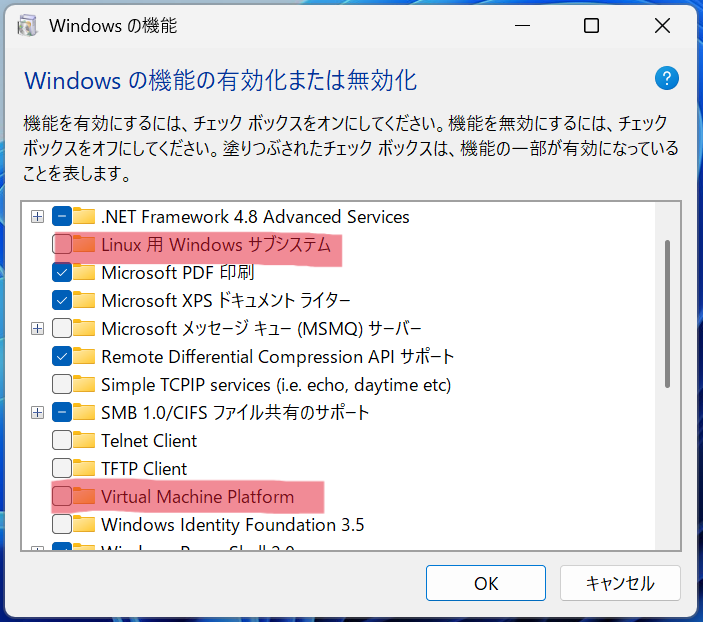

# Windows PCでWSLを使えるようにする手順

## 1. 前提条件を確認

- Windows 10 (2004以降) または Windows 11 が必要
- 管理者権限のあるユーザーで操作する 

## 2. WSLの有効化とインストール

- PowerShellを管理者権限で開いて以下コマンドを実行する

    ```PowerShell
    wsl --install
    ```

- このコマンドを実行することで、Windowsの機能の有効化または無効化（下図参照。Linux用WindowsサブシステムとVirtual Machine Platform）の設定が自動でされる
- 加えて、このコマンドを実行することで、Linuxカーネルのインストールとデフォルトのディストリビューション（Ubuntu）のインストールもされる



## 3. PCを再起動

- コマンド完了後、再起動が求められるので再起動する

## 4. 初回セットアップ

- 再起動後に自動でUbuntu（など選んだ Linux ディストリビューション）が起動し、以下を設定するよう求められる：

    - Linux用のユーザー名
    - パスワード（入力した文字は表示されないが、入力はされている。一度入力した後、もう一度入力を求められる）

- これでLinux環境が利用可能になる
- Linux環境から抜けるにはコマンドラインに`exit`と打って実行する
- 以下一連の操作のイメージ

    ```PowerShell
    PS C:\WINDOWS\system32> wsl --install -d Ubuntu-24.04 # wsl --installでディストリがインストールされていなかったので別途ディストリだけインストールした
    ダウンロードしています: Ubuntu 24.04 LTS
    インストールしています: Ubuntu 24.04 LTS
    ディストリビューションが正常にインストールされました。'wsl.exe -d Ubuntu-24.04' を使用して起動できます
    Ubuntu-24.04 を起動しています...
    Provisioning the new WSL instance Ubuntu-24.04
    This might take a while...
    Create a default Unix user account: sakih # Linuxアカウントのユーザ名を入力
    New password: # パスワードを入力
    Retype new password: # パスワードを再入力
    passwd: password updated successfully
    To run a command as administrator (user "root"), use "sudo <command>".
    See "man sudo_root" for details.

    sakih@DESKTOP-9RA8983:/mnt/c/WINDOWS/system32$ exit # Linux環境に自動で入れる。exitコマンドで出る
    exit
    PS C:\WINDOWS\system32> # Windows環境に戻る
    ```

## 5. （オプション）ディストリビューションの選択

- Ubuntu 以外を使いたい場合は、以下コマンドでインストール可能なディストリビューションを確認できる

    ```PowerShell
    wsl --list --online
    ```

- 例：Debian をインストールしたい場合

    ```PowerShell
    wsl --install -d Debian
    ```

## 6. バージョン確認

- 最後に、インストールされたWSLとディストリビューションのバージョンを確認してインストールがうまくできていそうか確認する

    ```PowerShell
    wsl --version # インストールしたWSLのバージョンを表示するコマンド
    wsl --list --verbose # インストールしたディストリビューションのバージョンを表示するコマンド
    ```

- 表示例（`wsl --version`）：

    ```PowerShell
    WSL バージョン: 2.5.10.0
    カーネル バージョン: 6.6.87.2-1
    WSLg バージョン: 1.0.66
    MSRDC バージョン: 1.2.6074
    Direct3D バージョン: 1.611.1-81528511
    DXCore バージョン: 10.0.26100.1-240331-1435.ge-release
    Windows バージョン: 10.0.26100.4946
    ```

- 表示例（`wsl --list --verbose`）：

    ```PowerShell
    NAME      STATE   VERSION
    * Ubuntu    Running 2
    ```

## 7. おまけ）VSCodeからWSLに接続する

- まず、VSCodeに拡張機能「WSL（ms-vscode-remote.remote-wsl）」を入れる
- 次に、PowerShellで使いたいディストリビューションを起動させておく（例：`wsl -d Ubuntu-24.04`）
- 使いたいディストリビューションが起動されているか、`wsl -l -v`で確認する
- VSCode画面左下にある「><」アイコンをクリックする
- VSCode画面上に出てくるドロップダウンの中から「Connect to WSL」→「Ubuntu-24.04」を選択する
- 新しく画面が開いて左下に「WSL: Ubuntu-24.04」と出てくれば成功、WSL上に入れたということ
- 画面左側でOpen Folderを選択し、「/home/ユーザ名」を選択する
- Linux環境（ディストリビューション）側のフォルダが開ける

## 疑問・トラブルシューティング

### Q1：`wsl --install`でインストールされるのはWSL2か？

→ そう。デフォルトでWSL2がインストールされるようになっている。`wsl --version`でWSLバージョンが2.X.X.XならWSL2

### Q2：WSLとWSL2の違いは何か？

→ WSL1は互換レイヤー方式（WindowsがLinuxシステムコールを翻訳して実行する）、WSL2は軽量VM上で本物のLinuxカーネルを動かす方式

### Q3：`wsl --install`でUbuntuがインストールできていない（`wsl --list --verbose`を実行しても何も表示されない）んだけど、どうしたらいいの？

→ `wsl --list --online`でインストール可能なディストリビューションを調べて、欲しいディストリビューションを`wsl --install -d ディストリビューション名`でインストールすればOK

### Q4：UbuntuとUbuntu-24.04どっちをインストールすれば良い？

→ Ubuntu（無印）は最新のLTSのUbuntuのエイリアス※。チーム開発など、バージョンを明示的に揃える必要がある場合には、使わない方がいい。バージョンを明示してインストールした方が確実に同じものをインストールできる

※エイリアスとは？

→ 定義済みの略称のこと。例えば、最新のLTSのUbuntuがUbuntu-24.04なら、Ubuntu-24.04をUbuntuと言い換えているという意

### Q5：1つのWSLに複数種類のディストリビューションをインストールすることはできるの？

→ できる。使い分けは、

### Q6：ディストリビューションをインストールした時に登録するユーザ名・パスワードはいつ使うの？

→ ユーザ名をもとにLinux環境下でホームディレクトリ（`/home/ユーザ名`）が作られる。また、`sudo`を実行する際に、ここで設定したパスワードの入力が求められる
