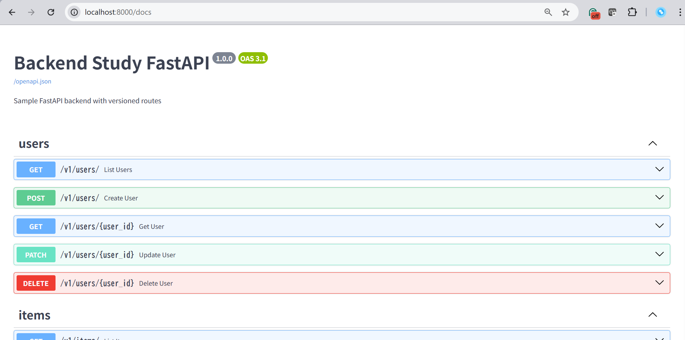

## この記事で取り組んだことの概要

- FastAPIで何ができるか、試してみて気づいたことをまとめた
- 基本的なCRUD操作を実装してみた
- Swagger UIで、作成したAPIの動作確認してみた
- DBとの接続はしていない。簡単のため、データはスクリプトに埋め込んでいる（※今後分離を試みる予定）

## 前提

- Windows PCを使用。WSL2上で開発している。ディストリビューションはUbuntu-24.04
- WSL2上にDocker Engineをインストール済（Windows PCにDocker Desktopはインストールしていない）
- 開発ディレクトリはWSL2上の`/home/projects/backend-study_fastapi-test`

## ディレクトリ構成

- FastAPIのソースコードは、開発ディレクトリ内の`app/`直下に集約
- Pythonのパッケージ解決（※以下に補足を記載）のため、`app/`と`routers/`に`__init__.py`（中身は何も書かない。空ファイル）を必ず入れる。

    ```txt
    /home/ユーザー名/projects/
    └──  backend-study_fastapi-test/
        ├── app             # FastAPIのソースコードはここに入れる
        │   ├── __init__.py
        │   ├── main.py
        │   └── routers
        |       ├── __init__.py
        |       ├── items.py
        |       └── users.py 
        ├── Dockerfile
        ├── requirements.txt
        └── compose.yml
    ```

### ※補足：Pythonのパッケージ解決とは？

→ **「解決（resolve）」= Pythonが`import`文をどう辿って目的のモジュールを見つけるか**という仕組みのこと

1. `__init__.py`の役割

    - そのフォルダを「Pythonパッケージ」として認識させるマーカー
    - このファイルがあることで、Pythonはそのフォルダをimportの対象にできる
    - このファイルが無いと、そのフォルダに入っているスクリプトをimportすることができず、`ModuleNotFoundError: No module named 'app.routers'`のようなエラーになる

2. Pythonのパッケージ解決の仕組み

    - Pythonが`import`を実行するときは1. **モジュール**（単一の.pyファイル） 2. **パッケージ** （`__init__.py`を含むディレクトリ）の順で探す
    - `__init__.py`がないと、そのディレクトリはただのフォルダ扱いでimportできない

## サンプルコード & 動作確認

### サンプルコード

- 以下サンプルコードでは、データをDBに分離できておらず、スクリプトの中に埋め込んでしまっている

    ← まずはFastAPIの基本理解を優先するためにそうしている

- `app/main.py`: `app`インスタンスを定義しているメインのスクリプト。このコードをもとにアプリが作られる

    ```python
    from fastapi import FastAPI
    from fastapi.middleware.cors import CORSMiddleware # CORSを処理するためのミドルウェア
    from app.routers import users, items

    app = FastAPI(
        # 以下OpenAPIスキーマとSwagger UI(/docs)に反映されるメタ情報
        title="Backend Study FastAPI",
        version="1.0.0",
        description="Sample FastAPI backend with versioned routes",
    )

    # CORS（開発中はワイルドカードで簡便に。実運用は限定推奨）
    app.add_middleware(
        CORSMiddleware,
        allow_origins=["*"], # 許可するオリジンのリスト。"*"は全許可の意。開発中は"*"で良いが、運用時は具体的なオリジン名を記載する必要がある
        allow_credentials=True, # Cookieや認証ヘッダの送受信を許可するかどうか
        allow_methods=["*"], # 許可する HTTP メソッド
        allow_headers=["*"], # 許可するカスタムヘッダ
    )

    # ルーターを /v1 配下にマウント（= URLパス方式でバージョニング）
    app.include_router(users.router, prefix="/v1")
    app.include_router(items.router, prefix="/v1")

    # ヘルスチェック(サーバーが起動してリクエストを受け付けられる状態か確認するに、Zabbixなどの監視ツールが定期的にたたく用のAPI)
    @app.get("/health", tags=["health"])
    def health():
        return {"status": "ok"}
    ```

- `app/routers/users.py`: `/users`配下のAPIを定義したスクリプト。ユーザ情報を格納したDBから、検索キーワードやIDで絞り込んで情報を取り出したり、新しいユーザを追加したり、ユーザ情報を更新したり、ユーザを削除したりする

    ```python
    from typing import Annotated, List, Optional
    from fastapi import APIRouter, HTTPException, Path, Query
    from pydantic import BaseModel, Field

    # prefix="/users"：このルーター配下の全パスの先頭に /users が付与される（例：@router.get("/") は実URL /users/）
    # tags=["users"]：OpenAPI/Swagger UI 上のグルーピングに使われる
    router = APIRouter(prefix="/users", tags=["users"])

    # === Pydantic v2 スタイルのモデル ===

    # 共通フィールドnameを定義。Fieldで文字長を制約し、OpenAPIにも反映される
    class UserBase(BaseModel):
        name: str = Field(min_length=1, max_length=50)

    # 作成時の入力用。将来的にemailなどを追加してもUserへの影響を分離できる
    class UserCreate(UserBase):
        pass

    # 部分更新（PATCH）用。OptionalにしてNoneは「更新しない」を意味する
    class UserUpdate(BaseModel):
        name: Optional[str] = Field(default=None, min_length=1, max_length=50)

    # レスポンスなどで返す確定形。idを含める
    class User(UserBase):
        id: int

    # お手軽なインメモリ DB（実務では RDB 等に置き換え）
    _FAKE_DB: list[User] = [
        User(id=1, name="Alice"),
        User(id=2, name="Bob"),
    ]

    # データベースにある大量のユーザを、検索でき(q)・必要な件数だけ(limit)・必要な位置から(offset)取り出せるようにできるAPI
    # response_model=List[User]：出力のスキーマを固定し、不要なフィールドを除去してOpenAPIにも反映する
    @router.get("/", response_model=List[User])
    def list_users(
        # 以下、クエリ引数
        q: Annotated[Optional[str], Query(description="部分一致で絞り込み")] = None, # 検索キーワードで部分一致検索
        limit: Annotated[int, Query(ge=1, le=100)] = 50, # 表示レコード数を1-100に制約
        offset: Annotated[int, Query(ge=0)] = 0, # 0以上に制約
    ):
        data = _FAKE_DB
        # 検索キーワードは、空欄でなければ絞り込みされる。なければあるデータ全て表示される
        if q:
            # 検索キーワードに全て小文字にする、かつ、FAKE_DBのname列も全て小文字にして部分一致検索をする
            data = [u for u in data if q.lower() in u.name.lower()]
        return data[offset : offset + limit] # 表示範囲ぶんだけ返す

    # ユーザIDがXXのユーザ名を取り出す
    # 1つのユーザIDに複数人いれば、複数人が表示される
    @router.get("/{user_id}", response_model=User)
    def get_user(
        user_id: Annotated[int, Path(ge=1, description="ユーザーID")]
        # Path(ge=1)：パスパラメータuser_idは1以上であることを保証する
    ):
        user = next((u for u in _FAKE_DB if u.id == user_id), None)
        if not user:
            # HTTPExceptionはFastAPIがJSON化して返す
            raise HTTPException(status_code=404, detail="User not found")
        return user

    # 新しいユーザを_FAKE_DBに追加する
    # 入力は UserCreate。フィールド検証は自動
    # status_code=201：作成成功の慣習に従う。余裕があればLocationヘッダを返す設計も望ましい
    @router.post("/", response_model=User, status_code=201)
    def create_user(payload: UserCreate):
        # new_id：現在の最大ID+1という単純払い出し。実務ではDBのAutoIncrementやUUIDを使うべき
        new_id = max((u.id for u in _FAKE_DB), default=0) + 1
        user = User(id=new_id, **payload.model_dump())
        _FAKE_DB.append(user)
        return user

    # ユーザの情報を更新する
    @router.patch("/{user_id}", response_model=User)
    def update_user(user_id: int, payload: UserUpdate):
        for i, u in enumerate(_FAKE_DB):
            if u.id == user_id:
                data = u.model_dump()
                patch = {k: v for k, v in payload.model_dump().items() if v is not None}
                data.update(patch)
                _FAKE_DB[i] = User(**data)
                return _FAKE_DB[i]
        raise HTTPException(status_code=404, detail="User not found")

    # ユーザの削除をする
    # 成功時は本文なしの 204 を返す。RESTの慣習に従う
    # 変化がなければ（＝該当IDが無ければ）404を返す
    @router.delete("/{user_id}", status_code=204)
    def delete_user(user_id: int):
        global _FAKE_DB # 再束縛しているものの、スレッドセーフではない
        before = len(_FAKE_DB)
        _FAKE_DB = [u for u in _FAKE_DB if u.id != user_id]
        if len(_FAKE_DB) == before:
            raise HTTPException(status_code=404, detail="User not found")
        return
    ```

- 補足）`app/routers/users.py`で定義したエンドポイントまとめ

    | メソッド   | パス               | 役割           | ステータス   |
    | ------ | ---------------- | ------------ | ------- |
    | GET    | `/v1/users/`     | 一覧（検索/ページング） | 200     |
    | GET    | `/v1/users/{id}` | 個別取得         | 200/404 |
    | POST   | `/v1/users/`     | 作成           | 201     |
    | PATCH  | `/v1/users/{id}` | 部分更新（差分適用）   | 200/404 |
    | DELETE | `/v1/users/{id}` | 削除           | 204/404 |

- `app/routers/items.py`: `/items`配下のAPIを定義したスクリプト。商品情報を格納したDBから、検索キーワードやIDで絞り込んで情報を取り出したり、新しいユーザを追加したり、ユーザ情報を更新したり、ユーザを削除したりする

    ```python
    from typing import List, Optional
    from fastapi import APIRouter, HTTPException, Query
    from pydantic import BaseModel, Field

    router = APIRouter(prefix="/items", tags=["items"])

    # 共通フィールドを定義する基底スキーマ
    # name は1〜100文字、price は0以上というバリデーションが宣言的に付与され、OpenAPIにも反映される
    class ItemBase(BaseModel):
        name: str = Field(min_length=1, max_length=100)
        price: float = Field(ge=0)

    # ItemCreate は作成要求の入力用スキーマである。将来 description 等を追加しても出力側とは独立に進化できる
    class ItemCreate(ItemBase):
        pass

    # Item は応答用の完全形スキーマである。id を含めることで、作成後の応答や一覧の要素として使える
    class Item(ItemBase):
        id: int

    # 単純なリストでデータを保持している学習用実装である。プロセス再起動で消える、並行アクセスに弱い（スレッドセーフでない）などの制約があるため、実務ではRDBやKVストアを使うべきである
    _FAKE_ITEMS: list[Item] = [
        Item(id=1, name="Pen", price=120),
        Item(id=2, name="Notebook", price=380),
    ]

    # 商品の一覧取得
    # response_model=List[Item] により、返却JSONの形を固定し、不要なフィールドがあれば自動で除去される。OpenAPIにも反映される
    # 価格の上限と下限をクエリパラメータとして設定し、絞り込むことができる
    @router.get("/", response_model=List[Item])
    def list_items(
        min_price: Optional[float] = Query(default=None, ge=0),
        max_price: Optional[float] = Query(default=None, ge=0),
    ):
        items = _FAKE_ITEMS
        if min_price is not None:
            items = [i for i in items if i.price >= min_price]
        if max_price is not None:
            items = [i for i in items if i.price <= max_price]
        return items

    # 商品IDに対応する商品名を取り出す
    @router.get("/{item_id}", response_model=Item)
    def get_item(item_id: int):
        item = next((i for i in _FAKE_ITEMS if i.id == item_id), None)
        if not item:
            raise HTTPException(status_code=404, detail="Item not found")
        return item

    # 商品を追加する
    @router.post("/", response_model=Item, status_code=201)
    def create_item(payload: ItemCreate):
        new_id = max((i.id for i in _FAKE_ITEMS), default=0) + 1
        item = Item(id=new_id, **payload.model_dump())
        _FAKE_ITEMS.append(item)
        return item
    ```

- 補足）`app/routers/items.py`で定義したエンドポイントまとめ

    | メソッド | パス               | 役割         | 成功コード |
    | ---- | ---------------- | ---------- | ----- |
    | GET  | `/v1/items/`     | 一覧（価格フィルタ） | 200   |
    | GET  | `/v1/items/{id}` | 個別取得       | 200   |
    | POST | `/v1/items/`     | 作成         | 201   |

### サンプルコード(環境まわり)

- `Dockerfile`

    ```dockerfile
    # ベースイメージの指定。slim は余計なツールが少ないため、サイズが小さく脆弱性表面も狭い
    FROM python:3.12-slim

    # 環境変数の設定
    # PYTHONDONTWRITEBYTECODE=1：__pycache__/（.pyc）を生成しない。不要なファイルを減らし、レイヤを汚さない
    # PYTHONUNBUFFERED=1：標準出力をバッファリングしない。ログがすぐに出る（K8sやComposeでデバッグしやすい）
    # PIP_NO_CACHE_DIR=off：pip のダウンロードキャッシュを保持する/しないの挙動。off はキャッシュを許可（ビルド時の再ダウンロードを減らす）。サイズと速度のトレードオフである
    # PIP_DISABLE_PIP_VERSION_CHECK=on：実行時の pip バージョンチェックを抑止して起動を速く静かにする
    ENV PYTHONDONTWRITEBYTECODE=1 \
        PYTHONUNBUFFERED=1 \
        PIP_NO_CACHE_DIR=off \
        PIP_DISABLE_PIP_VERSION_CHECK=on

    # 作業ディレクトリ。Dockerfileに対して相対パスで記載される
    # 以降の COPY や RUN の基準パスになる
    # uvicorn app.main:app の app/ ディレクトリをここに置く前提を作る
    WORKDIR /app

    # /appディレクトリは置いといて、先にrequirement.txtだけコピーすることにより、requirement.txtが前回と同じ内容であれば次のRUN pip installがスキップされてビルドにかかる時間が短縮する

    # COPY <コピー元> <コピー先>
    # コピー元：ビルドコンテキスト（通常は docker build を実行したディレクトリ配下）のファイルやフォルダ
    # コピー先：イメージ内のパス（この時点の WORKDIR が基準になる）
    # → つまり、ホストの requirements.txt を、イメージの /app/requirements.txt にコピーする

    # pip install --upgrade pip：新しめの pip で解決の安定性を狙う
    # pip install -r requirements.txt：実行時依存のみを入れる。開発専用ツール（lint/test）は別ファイルに分けるとイメージを細く保てる
    COPY requirements.txt .
    RUN pip install --upgrade pip && pip install -r requirements.txt

    # ここが開発と本番の分岐点。本番用にビルドする場合はコメントアウト解除
    # 開発：後述の Compose で ./app:/app/app をマウントし、ホットリロード運用するので COPY しない
    # 本番：ホストに依存せずイメージ単体で完結させるため、COPY を有効化してコードを取り込む
    # → したがって本番ビルド時は以下のコメントを外す（or ビルド引数やステージ分けで切り替える）
    # COPY app ./app

    # コンテナが待ち受けるポートのメタ情報。公開はしない（公開は -p 8000:8000 などランタイム側で行う）
    # ドキュメント性・ツール連携のために記載しておく
    EXPOSE 8000

    # デフォルト CMD は compose.yml で上書きされる（開発だと --reloadオプションが追加されている）
    # 既定の起動コマンド。ASGI サーバの Uvicorn に app.main:app（/app/app/main.py の app 変数）を渡す
    # 開発時は Compose 側で --reload を付けてホットリロードに切り替える（本番では --reload は使わない）
    CMD ["uvicorn", "app.main:app", "--host", "0.0.0.0", "--port", "8000"]
    ```

- 補足）なぜ本番は`Dockerfile`で`app`ディレクトリ丸ごとコンテナにコピーするのに、開発は`compose.yml`でコンテナ上に`app`ディレクトリ丸ごとをマウントしているのか？

    → 開発のときは、コードの変更をこまめにチェックしたいが、本番のときは、コードを変えたときに勝手にアプリに反映されてほしくないから 
    
    開発:

    - ソース変更を即時反映させたい → ホストの ./app をコンテナの /app/app にボリュームマウント
    - Uvicorn に --reload を付けると、ファイル監視 → 自動再起動で素早く反映

    本番:

    - デプロイ物を不変（immutable）にしたい → アプリコードを COPY してイメージ内に封入
    - ホスト環境差分に影響されず、再現性・移植性が高い
    - `--reload`はオフ、プロセス数やワーカーは gunicorn+uvicorn workers 構成などに寄せてもよい

- `compose.yml`(開発用を記載。本番の際は`command:`の行をコメントアウトする)

    ```yaml
    # Compose ファイルのトップキー。ここに複数のサービス(コンテナ定義)を列挙できる
    # 今回は api というサービス(FastAPIアプリ)を1つだけ持つ
    services:
    # サービスの名前。この名前で docker compose up api のように呼び出せる
    api: 
        build:
        context: . # `.`はプロジェクトルート(compose.yml がある場所)。Docker build に渡されるビルドコンテキストになる
        dockerfile: Dockerfile # ビルドに使う Dockerfile を明示。通常は省略しても ./Dockerfile が使われるが、わかりやすさのため指定している
        container_name: fastapi-api # 実行時のコンテナ名を固定する(省略しても良いが、プロジェクト名やサービス名などをハイフン区切りにして自動で命名される)
        command: uvicorn app.main:app --host 0.0.0.0 --port 8000 --reload # コンテナ起動時に実行するコマンド(Dockerfileにも書いてあるが、compose.ymlに書いてある情報で上書きされる)
        # app.main:app = /app/app/main.py の中にある app という FastAPI インスタンスを探す指定
        # --host 0.0.0.0 = コンテナ外(ホストPCや他コンテナ)からアクセス可能にするため
        # --port 8000 = サービスが待ち受けるポート
        # --reload = ソース変更を監視して自動リロードする。開発専用
        volumes:
        - ./app:/app/app:rw
        # ホストの ./app ディレクトリを、コンテナの /app/app にマウント
        # WSL 上のワークスペースで編集したコードが、コンテナ内に即反映される
        # :rw は read-write 権限。省略しても同じ意味だが明示されている
        ports:
        - "8000:8000"
        # ホストPCの 8000番ポート → コンテナの8000番ポート に転送
        # ブラウザで http://localhost:8000 にアクセスすれば FastAPI に届く
        # 左側（ホスト側）は変えてもよい（例: "8080:8000" なら http://localhost:8080 でアクセス）
    ```

- `requirements.txt`

    ```txt
    fastapi==0.111.0
    uvicorn[standard]==0.30.1
    pydantic==2.6.4
    ```

### 動作確認

- `docker compose up`で、`compose.yml`に基づいて、まだイメージが無ければ`Dockerfile`からイメージをビルドし、イメージがあればそれを使ってコンテナを生成するという意
- `--build`オプションをつけることで、**サービス起動の前に必ずイメージを再ビルドする**設定にできる。既にイメージがあっても、Dockerfileや依存が変わったかどうかに関係なく新しくイメージを生成する

    ```bash
    docker compose up --build
    ```

- http://localhost:8000/docs で Swagger UIの画面を開く

    

- http://localhost:8000/health で {"status":"ok"}が見れる


## FastAPI特有の概念

### 1. FastAPIにおける`app`インスタンスとは何か？

- `FastAPI`クラスを呼び出して生成したオブジェクト
- **ASGIアプリケーションそのもの**
- エンドポイントやミドルウェアを登録して管理する中核であり、かつ、OpenAPIドキュメントを生成するベースとなる

#### 補足1: ASGIアプリケーションとは？

- ASGI (Asynchronous Server Gateway Interface) は、Python製WebアプリやフレームワークとWebサーバーをつなぐための「共通インターフェース仕様」
- 従来のWSGIが同期処理しか扱えなかったのに対し、ASGIは非同期処理やWebSocketなどリアルタイム通信にも対応可能
- UvicornなどのASGIサーバーがHTTPリクエストをASGIイベント形式に変換し、FastAPIやStarletteといったアプリが処理を行う

#### 補足2: Uvicornとは？

- ASGIサーバーの代表的な実装で、Pythonの非同期アプリケーションを高速に動かすためのWebサーバー
- 内部では asyncio や uvloop を利用して効率的にイベントループを回し、高スループットを実現
- FastAPIやDjango Channelsを動かす際のデファクト標準サーバーであり、開発用のホットリロードや本番用のマルチワーカーもサポート

### 2. エンドポイントとは

- 外部からサービスにアクセスするための入り口（URL）のこと
- エンドポイントはURLの一部（末尾）に過ぎず、「ベースURL + エンドポイント」で完全なアクセス先のURLになる
- 例1: サーバーが http://localhost:8000 で動いているなら → http://localhost:8000/users
- 例2: デプロイ後に https://api.example.com で動いているなら → https://api.example.com/users
- 同じエンドポイント名でも、HTTPメソッド（GET / POST / PUT / DELETE …）によって処理を分けられる
- ただし、当たり前ではあるが、同じメソッド＋同じエンドポイントを二重に書くと最初に書いた処理が無視される（後（下）に書いた処理で上書きされる）

### 3. デコレータとは

- 関数やクラスに、新しい機能を後から付け足す仕組み
- 元の関数のコードを直接書き換えずに、処理を前後に挟み込むことができる
- 「@デコレータ名」と記載し、デコレータを適用したい関数の真上の行に記載する
- 簡単な例）`@my_decorator`がデコレータで、hello関数実行時に適用される

    ```python
    def my_decorator(func):
        def wrapper():
            print("前処理：関数が呼ばれる前に実行")
            func()
            print("後処理：関数が呼ばれた後に実行")
        return wrapper

    @my_decorator
    def hello():
        print("Hello, world!")

    hello()
    ```

    以下、実行結果

    ```txt
    前処理：関数が呼ばれる前に実行
    Hello, world!
    後処理：関数が呼ばれた後に実行
    ```

#### 補足1: FastAPIにおけるデコレータの役割とは

- FastAPIにおけるデコレータの役割とは、ルーティング定義をすること
- ルーティング定義とは？

    - 「どのURLにアクセスされたら、どの処理（関数やコントローラ）を実行するか」を決める設定のこと

        = 「URLパターン」と「処理」を結びつけるルール

#### 補足2: FastAPIにおけるよく使うデコレータ一覧

- FastAPIにて定義済み関数で、APIのCRUD操作（Create, Read, Update, Delete）いずれも可能
    - `@app.get("エンドポイントのURL")`: 取得
    - `@app.post("エンドポイントのURL")`: 新規作成
    - `@app.put("エンドポイントのURL")`: 全体更新
    - `@app.patch("エンドポイントのURL")`: 部分更新
    - `@app.delete("エンドポイントのURL")`: 削除
- ここでいう`app`とは、`app = FastAPI()`（FastAPIクラスをインスタンス化したもの）。プログラムの頭で呪文のように宣言しがち

### 4. APIルータとは

- FastAPIの`APIRouter`クラスのインスタンスのこと
- APIエンドポイントの集合
- 全てのエンドポイントをFastAPIクラスの`app`インスタンスに紐づけてしまうと、1つの`main.py`ファイルにたくさんの処理を記載することになってしまい、可読性が下がる

    → APIをグループ化して、グループごとに`.py`ファイルを分けることで、読みやすくなるし、メンテナンスがしやすくなる。それを叶えるのがAPIルータである

- 具体例:

    例えば、main.pyに書いてある以下のAPIを別ファイルに切り出したい場合、

    ```python
    @app.get("/v1/users")
    def list_users():
        return [{"id": 1, "name": "Alice"}]
    ```

    上記部分を削除したのち、`main.py`に以下を記載し、かつ、

    ```python
    app.include_router(users.router, prefix="/v1")
    ```

    `routers/users.py`に以下を記載することで、

    ```python
    from fastapi import APIRouter

    router = APIRouter(prefix="/users", tags=["users"])

    @router.get("/")
    def list_users():
        return [{"id": 1, "name": "Alice"}]
    ```

    切り出すことができる。

### 5. APIのバージョン管理

- エンドポイントの頭に`/v1/`や`/v2/`をつける**URLパス方式**が一般的

    ```txt
    https://api.example.com/v1/users
    https://api.example.com/v2/users
    ```

- 大規模な開発の場合は、**サブドメイン**を設けることもある

    ```txt
    https://v1.api.example.com/users
    https://v2.api.example.com/users
    ```

- バージョンでAPIをグループ化することが多く、その際はFastAPIの`APIRouter`クラスで可能(詳細は前述)
